# Сервис пользователей

## Задача

Выполняет функцию **IdentityProvider**. Включает в себя авторизацию и администрирование пользователей. Написан на **Python**

## Список файлов

* [**certs**](./certs/)
  * [*jwks.json*](./certs/jwks.json) - файл с набором JWK ключей
* [**controller**](./controller/)
  * [*api.py*](./controller/api.py) - модуль, администрирующий все контроллеры в приложении
  * [*user.py*](./controller/user.py) - контроллер пользователя
* [**dto**](./dto/)
  * [*user.py*](./dto/user.py) - все (кроме бд) модели пользователя (в том числе авторизационные)
* [**exceptions**](./exceptions/)
  * [*handlers.py*](./exceptions/handlers.py) - функции, перехватывающие эксепшены
  * [*http.py*](./exceptions/http.py) - hhtp эксепшены
* [**model**](./model/)
  * [*user.py*](./model/user.py) - модель бд пользователя
* [**repository**](./repository/)
  * [*user.py*](./repository/user.py) - репозиторий пользователя
* [**schemas**](./schemas/)
  * [*api_responses.py*](./schemas/api_responses.py) - примеры апи ответов для в документации swagger
  * [*response.py*](./schemas/response.py) - описание ответов endpoint-ов
* [**service**](./service/)
  * [*user.py*](./service/user.py) - сервис пользователей
* [**utils**](./utils/)
  * [*addons.py*](./utils/addons.py) - вспомогательные функции
  * [*consts.py*](./utils/consts.py) - константы
  * [*enums.py*](./utils/enums.py) - enum-ы
  * [*jwks.py*](./utils/jwks.py) - функции работы с jwk
  * [*jwt.py*](./utils/jwt.py) - функции работы с jwt
  * [*settings.py*](./utils/settings.py) - настройки сервиса (глобальные настройки сервиса и бд идут из файла [**config.yaml**](/src/backend/config.yaml))
  * [*validate.py*](./utils/validate.py) - функции валидации
* [**main.py**](./main.py) - основной файл запуска сервиса

## Endpoint-ы

* 

  
 POST(/api/v1/user/login/) - логин 

  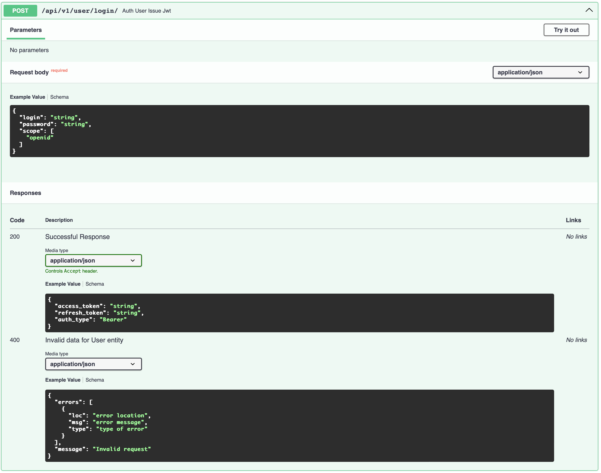
  

* 

  
 POST(/api/v1/user/register/) - регистрация 

  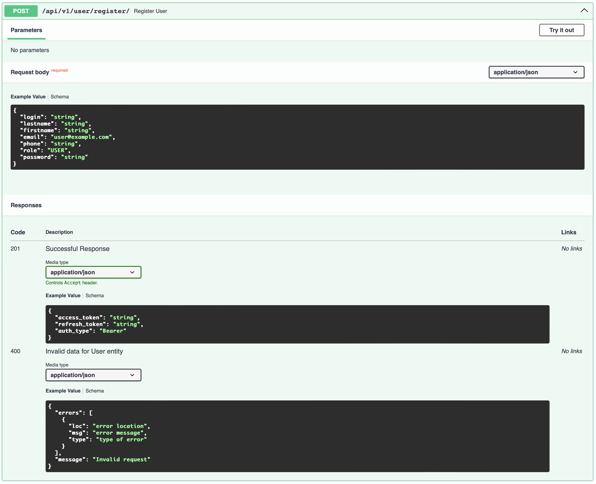
  

* 

  
 POST(/api/v1/user/refresh/) - обновление токена 

  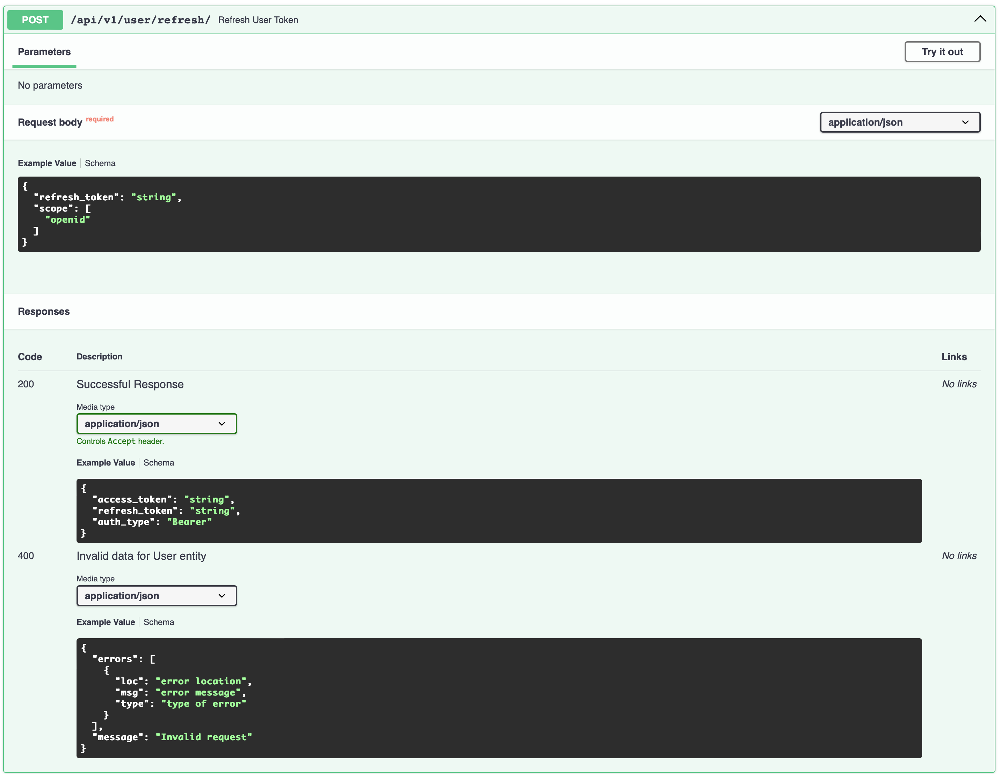
  

* 

  
 GET(/api/v1/user/.well-known/jwks.json) - список ключей JWK 

  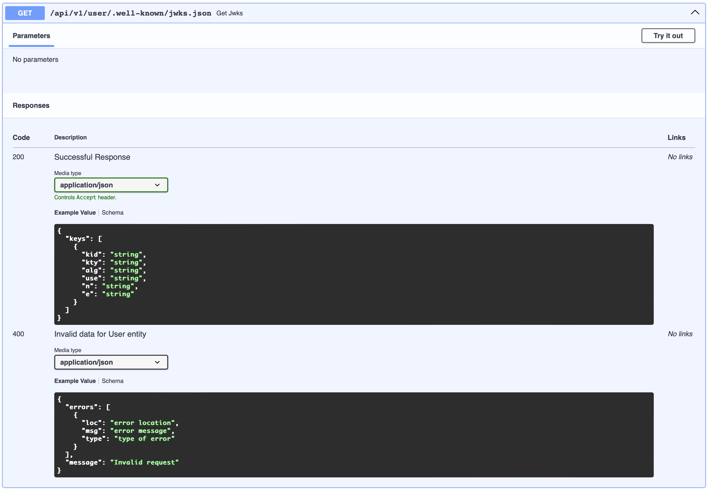
  

* 

  
 GET(/api/v1/user/me/) - получить информацию о себе 

  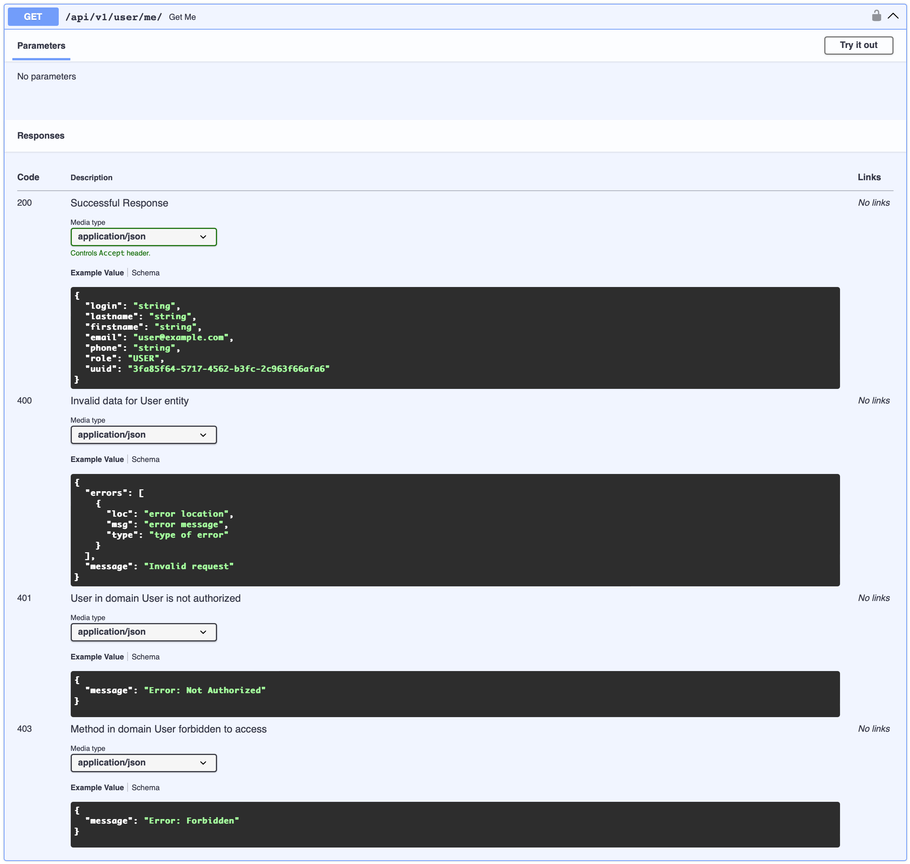
  

* 

  
 PATCH(/api/v1/user/me/) - обновить информацию о себе 

  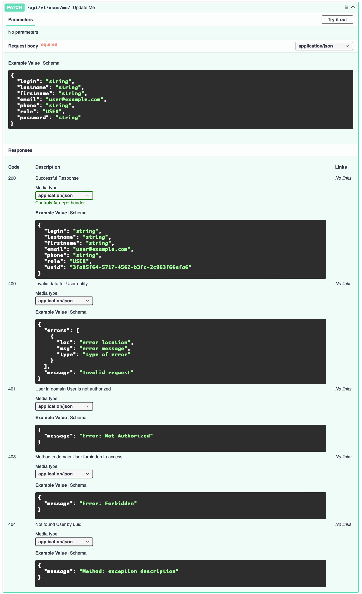
  

* 

  
 GET(/api/v1/user/) - получить список пользователей по фильтрам 

  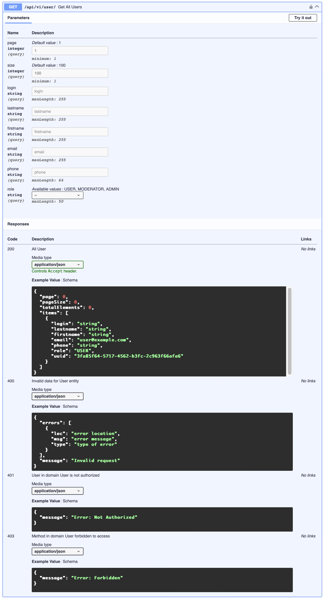
  

* 

  
 POST(/api/v1/user/) - создать пользователя 

  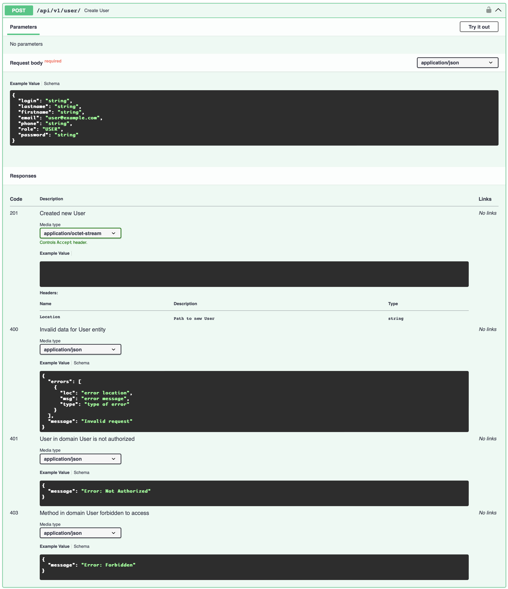
  

* 

  
 GET(/api/v1/user/{uuid}) - получить пользователя по uuid 

  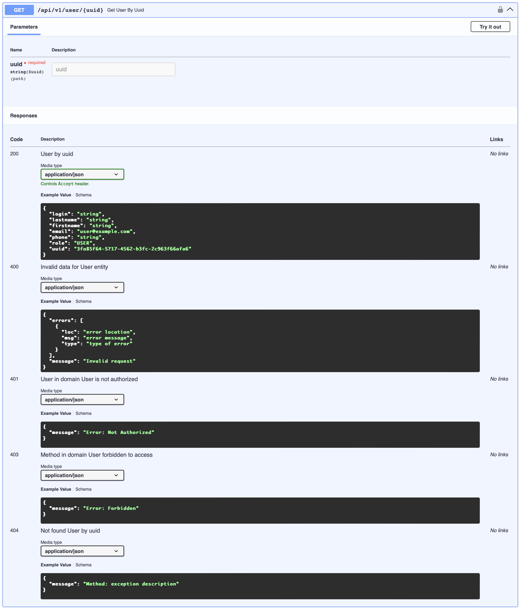
  

* 

  
 PATCH(/api/v1/user/{uuid}) - обновить пользователя по uuid 

  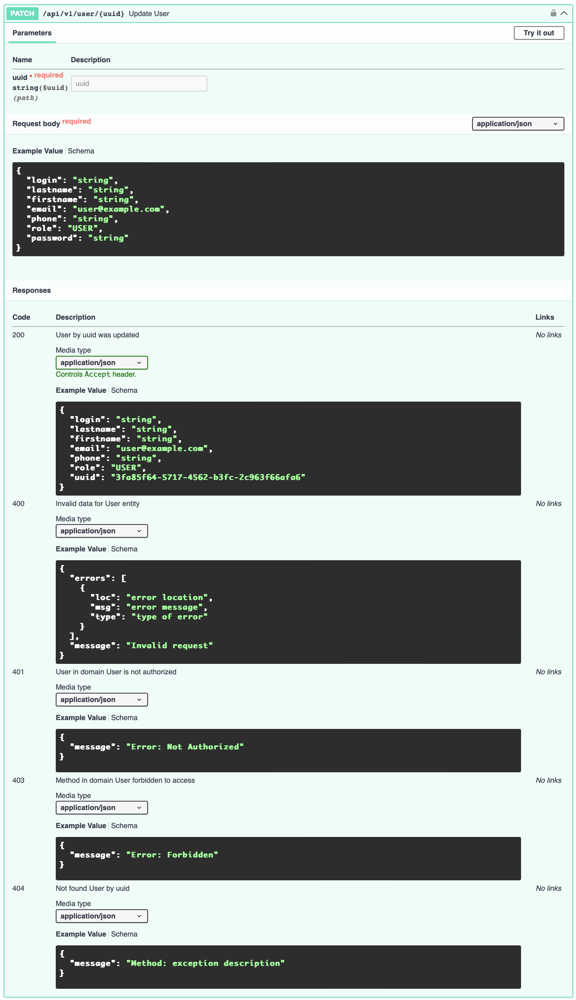
  

* 

  
 DELETE(/api/v1/user/{uuid}) - удалить пользователя по uuid 

  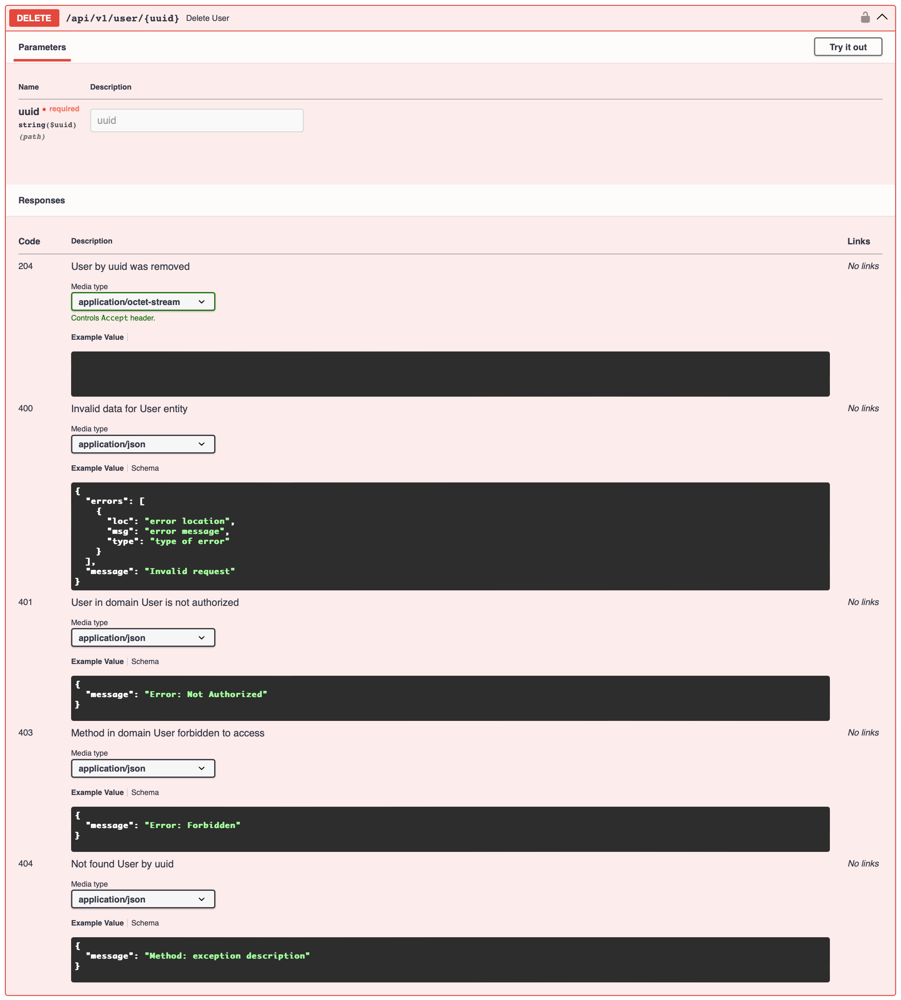
  

## Технологии и термины

1. [IdentityProvider](https://habr.com/ru/articles/779170/)
2. [OpenIDConnect](https://habr.com/ru/companies/nixys/articles/566910/)
3. [Bearer](https://www.diera.ru/blog/bearer-token/)
4. [JWT](https://habr.com/ru/articles/340146/)
5. [JWK/JWKSet](https://wiki.openbankingrussia.ru/security/json-web-key-structure)

## Библиотеки

1. [JWCrypto](https://jwcrypto.readthedocs.io/en/latest/)
2. [bcrypt](https://pypi.org/project/bcrypt/)

## Вдохновение

1. [JWT/JWKS](https://www.emqx.com/en/blog/jwt-authentication-and-jwks-endpoint-in-mqtt)
2. [Аутентификация FastAPI](https://youtu.be/Fg4tfUtJiT8?si=9m9DlqGuvFwPI4a1)
3. [JWT Acess Token в FastAPI](https://youtu.be/B_JDYLXS8Ww?si=PQeR-KWnNotRmUZM)
4. [JWT Refresh Token в FastAPI](https://youtu.be/sgEvwwpEh7s?si=xFTQEWcxEcocQQpR)

***
[@amunra2](https://t.me/amunra2), 2024
